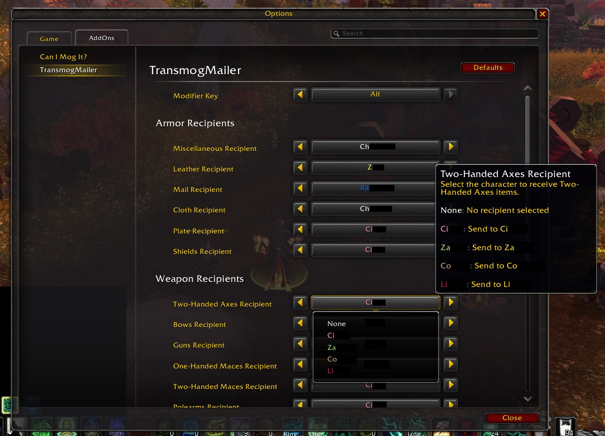

# TransmogMailer

**TransmogMailer** is a World of Warcraft addon that helps you manage unneeded transmog items by identifying which characters can use them, then mailing them accordingly.

It uses **[Can I Mog It](https://www.curseforge.com/wow/addons/can-i-mog-it)** behind the scenes to determine if an item is transmoggable and whether your characters already know it.

## 🛠 Basic Usage

1. **Install Can I Mog It** alongside TransmogMailer.
2. Log in to **each character** you want to track. Wait a moment for *Can I Mog It* to scan that character’s known appearances.
3. Once all relevant characters have been scanned, go to **Blizzard Options → AddOns → TransmogMailer**.
4. There, you can configure which characters should receive which types of gear.

## 🔍 What It Does

- Checks if the current character needs a transmog item.
- If not, checks your configured list to see who should receive it.
- Adds that item to a mailing queue for easy sending.

## ❗ Notes

- TransmogMailer does **not** make automatic decisions or suggestions — you configure the logic yourself in the addon settings.
- Requires **Can I Mog It** to function properly.

